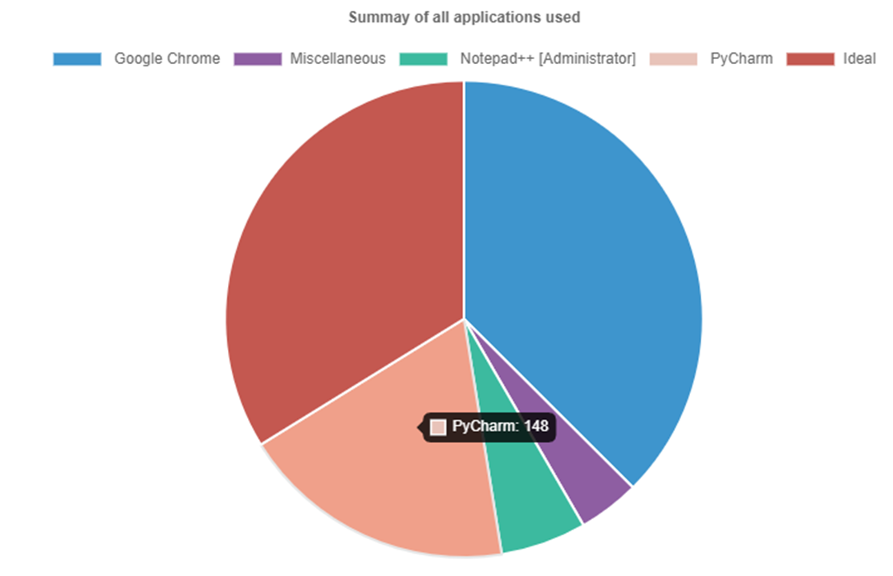
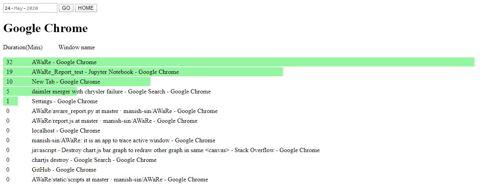
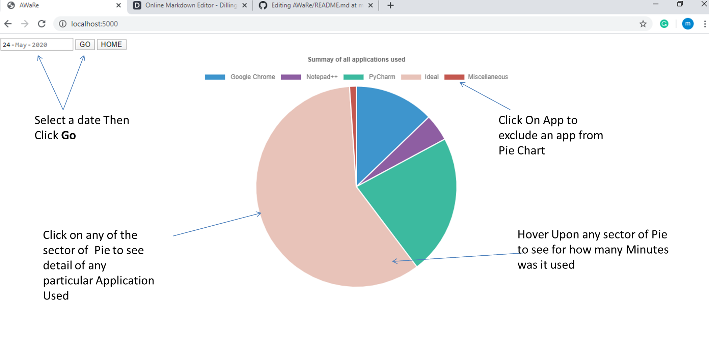
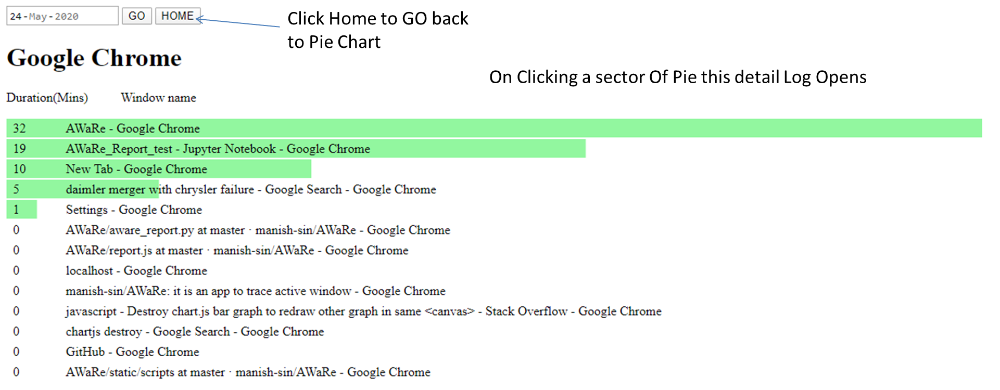

# Aware

Aware is a tool to help you monitor self-efficacy (your confidence to finish a task in target time) while working on PC.

### How does it work?
It 
  - logs the name of active window and duration of activity on it
  - produces a report of logs in a meaningful way
  - 
### Features

  - It works locally on your PC and does not require internet; Hence it is highly safe as it doesn't share data over the internet
  - The report is accessible on your browser itself
  - Reports are interactive and easy to explore, with a clean interface.
  - Configurable for "Start on PC startup"
  
### Instalation

### Use case

Case 1: Every professional estimate the time he will require to finish a task, before hi start, whether the task it to ppt, Finish a report or photoshop an image He/she will be able to monitor that by knowing how long did he use certain applications to achieve his task. If this is done on a regular basis he/she will be able to calibrate his self-efficacy. 

For example: If I had decided to finish writing a certain part of this software, I should ask myself should I have taken 148 mins?
Fig 1:

Case 2: Looking into detail of each app you can further filter out your NVA and distraction, like while doing a course, you spent more time on Netflix to freshen up. For me take away was I spent a lot of time searching emails, which means I have not organized my mail well (of course screenshot does not show my mail i.e ;). I will improve on that.
Fig 2:

Case 3: You may think of more and let us know ;)
### Exploring Report
To open the report, make sure Aware is running  and then hit "http://localhost:5000/". 

### How to Turn it ON and OFF
# FAQ:
1. Why is there always a black window, while I run the Aware?
Ans: So that you are aware that your information is being logged. Information is precious. We thought to start Aware as service was not a good idea as of know.
2. Why report shows is only for 3 days?
Ans: We feel making a repository of such a report will lead to procrastination. Making this report temporarily motivates one to act to take decisions.
3. Does it track other activiies such as Mouse?
Ans: No it dosent track any thing else accept Name of Active Window.
4. Is data logged by Aware safe?
Ans: All logs are save on you PC locally, it not sent over internet. The code for Aware is available available, you may check it.

